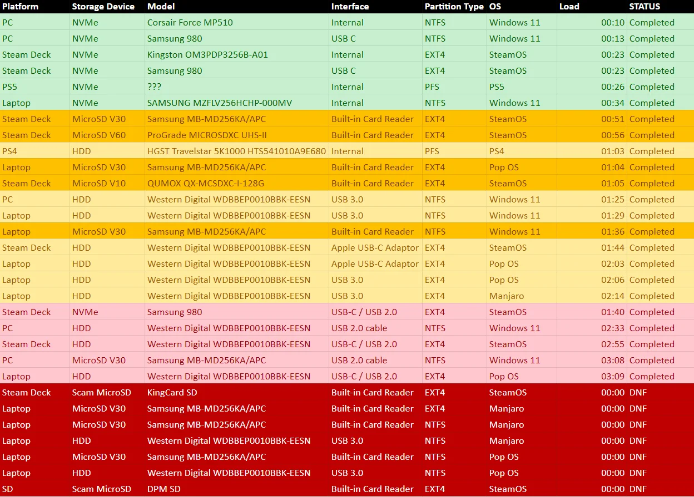

# Gaming Hardware - Portable and Desktop

<!-- TOC start (generated with https://github.com/derlin/bitdowntoc) -->

- [Portable gaming](#portable-gaming)
    * [Steam Deck](#steam-deck)
    * [Other Options](#other-options)
        + [ROG Ally](#rog-ally)
        + [Lenovo Legion Go](#lenovo-legion-go)
        + [GPD Win Mini](#gpd-win-mini)
        + [GPD Win 4](#gpd-win-4)
        + [GPD Win Max 2](#gpd-win-max-2)
        + [GPD Pocket 3](#gpd-pocket-3)
    * [Mobile Game Device Accessories](#mobile-game-device-accessories)
        + [Hubs and docks - ROG Ally](#hubs-and-docks---rog-ally)
        + [Hubs and docks - Steam Deck](#hubs-and-docks---steam-deck)
        + [Portable monitors](#portable-monitors)
        + [Lapdock for Mobile](#lapdock-for-mobile)
        + [NVME and power](#nvme-and-power)
        + [Micro SD card](#micro-sd-card)

- [Accessories and Peripherals](#accessories-and-peripherals)
    + [Thunderbolt/USB NVME Adapter](#thunderboltusb-nvme-adapter)
    + [Tile](#tile)
    + [Monitor](#monitor)
    + [Additional high capacity storage (SATA)](#additional-high-capacity-storage-sata)
    + [Keyboard](#keyboard)
    + [Mouse](#mouse)
    + [Mouse Pad or Desk Pad](#mouse-pad-or-desk-pad)
    + [Joystick](#joystick)

- [Gaming PC](#gaming-pc)
    * [Overview](#overview)
    * [Components](#components)
        + [CPU](#cpu)
        + [CPU Cooler](#cpu-cooler)
        + [Thermal Compound](#thermal-compound)
        + [Motherboard](#motherboard)
        + [Thunderbolt 4 card](#thunderbolt-4-card)
        + [RAM](#ram)
        + [SSD](#ssd)
        + [Case](#case)
        + [Case Fans](#case-fans)
        + [Power Suppply](#power-suppply)

- [Software](#software)
    + [MX Linux](#mx-linux)
    + [MX Workbench](#mx-workbench)
    + [Phosh](#phosh)
    + [Batocera](#batocera)

<!-- TOC end -->

# Portable gaming

## Steam Deck

Since the release of the Steam Deck, we have started to see competing devices in the same space such as the ROG Ally.

The Steam Deck may still be the best choice

- There is a large library of games specifically targeting running well on this particular device
- The SteamOS software provides a great, reliable, clean, seamless experience for gaming
- Good battery life
- Good build quality
- It can still dual boot into windows (or anything)
- Very repairable, and even possible to do some upgrades

If the Steam Deck will primarily be used docked, and a separate upgraded NVME storage upgrade will be purchased, get the base model Steam Deck for $399

At this time, 2TB is the max capacity third party storage upgrade for the internal storage. It can also use microSD cards - 1TB cards are easy to find, and 1.5TB cards are starting to appear. 2TB cards are expected before long. Expect longer load times from microSD storage, but all games should function fine when loaded this way.

https://store.steampowered.com/steamdeck/

The carrying case that comes with the base model is functionally identical to the one from the 512GB model - the difference is purely external, aesthetic, and minor.

However, if the Steam Deck will sometimes be used alone as an undocked portable gaming device, it may still be worth going to the $649 model for the premium anti-glare screen.

There are 3rd party screens available, but not recommending those today. The other features of the $649 model are entirely inconsequential.

## Other Options

There are actually a ton of options now, and more coming. The available [ROG Ally](#rog-ally) and upcoming [Lenovo Legion Go](#lenovo-legion-go) in particular are notable, and Ayaneo should have a good device by year end 2023.

Currently the best options other than the Steam Deck seem to be the [GPD Win 4](#gpd-win-4) and [GPD Win Max 2](#gpd-win-max-2)

The GPD devices have a lot going for them, and they have a couple different size options.

https://www.custompc.com/lenovo/legion-go-release-date-specs-price

https://1drv.ms/x/s!Ai6e5DDA76ldyCBxQttYwNWsEpEg?e=5UNyoh

### ROG Ally
https://rog.asus.com/gaming-handhelds/rog-ally/rog-ally-2023/

The ROG Ally makes the most sense if you are committed to not owning a separate gaming PC but still have the budget for one. In that case you can buy one their proprietary connector external GPUs for it at a premium.

### Lenovo Legion Go

Big 10" screen, detachable controllers

Releases in October 2023

Custom model AMD chip - not clear what the performance will be yet.

https://www.lenovo.com/us/en/legiongo/

https://www.tomsguide.com/news/lenovo-legion-go

This one has Thunderbolt 4, so if you already have a discrete GPU available, it could be a full desktop replacement candidate. Not as good a candidate for this as the GPD devices.

The only good options for the GPU enclosure appear to be the Razer Core X or Core X Chroma. The Sonnet eGPU is limited to 2 slot width. Both the Core X and Core X Chroma support a 3 slot width GPU. The Core X Chroma has downstream USB supports, avoiding the need for a separate USB hub or dock.

However only the following specific models of the 4070 Ti GPU are expected to fit within the 3 slot width of the Razer eGPU enclosures:

- ASUS ProArt GeForce RTX 4070 Ti RTX4070TI-12G
- ASUS ProArt GeForce RTX 4070 Ti 12GB OC Edition PROART-RTX4070TI-O12G
- GIGABYTE GeForce RTX 4070 Ti WINDFORCE OC 12G GV-N407TWF3OC-12GD
- GIGABYTE GeForce RTX 4070 Ti EAGLE OC (rev. 2.0) GV-N407TEAGLE OC-12GD Rev2.0
- GIGABYTE GeForce RTX 4070 Ti GAMING OC V2 GV-N407TGAMING
- GIGABYTE AERO GeForce RTX 4070 Ti GV-N407TAERO OCV2-12GD
- ZOTAC GAMING GeForce RTX 4070 Ti Trinity OC ZT-D40710J-10P

Meanwhile 8 cards from Asus, Zotac, and PNY are too wide, and another 15 models are unknown status.

### GPD Win Mini

Probably only if you really like the physical layout for some reason - otherwise go for the Win 4 or Win Max 2

- 7" screen, light at 520 grams
- USB4 and Oculink
- 30mm m.2 slot like Steam Deck
- Up to 32GB of RAM
- microSD
- keyboard forward and always visible

https://gpd.hk/gpdwinminisdfewr

### GPD Win 4
- 6" screen, 600 grams
- 2280 M.2 slot
- Oculink and USB4, 1x full-featured USB-c 10Gpbs
- Up to 64GB of RAM
- microSD
- Sliding keyboard, side game controls
- Dock available
- Cellular available via addon that attaches to back

https://gpd.hk/gpdwin4

### GPD Win Max 2
- 10.1", 1005 grams is still smaller and lighter than anything called a laptop
- 2280 and 2230 M.2 slots
- Up to 64GB RAM
- Both SD and microSD
- Cellular support available (probably in 2230 slot)
- Oculink and USB4, 1x full-featured USB-c 10Gpbs, 5Gbps USB-A

https://gpd.hk/gpdwinmax2

### GPD Pocket 3

Cool as a work tool or mounted controller for industry. Not for gaming.

- 8", 700 grams
- Not for gaming, but does have fast ethernet and wifi, and Thunderbolt 4
- Can be display and keyboard for other devices
- RS-232 serial port
- IR camera
- Fingerprint sensor
- Stylus

https://gpd.hk/gpdpocket3

## Mobile Game Device Accessories

### Hubs and docks - GPD Win 4

In addition to the official dock and eGPU, any normal GPU can be used via Oculink with some additional bits starting at $220 + a power supply

https://smallformfactor.net/forum/threads/one-dock-unique-dual-port-egpu-dock-thunderbolt-oculink-m-2-0-26l.18337/

This is a custom thing for now, but should be available off the shelf before long

### Hubs and docks - ROG Ally

The XG Mobile GC32 at $800 is comparable to an RTX 3060 and is certainly VR capable. Expect great 1080p gaming, and maybe 2k

The XG Mobile GC33 at $2000 is a silly thing - maybe buy an entire desktop gaming rig instead. It does let you do 4k gaming on high settings but in this form factor, good cooling is not possible. The fan noise has been measured to reach at least 70 decibels in some demanding games, which is similar to a typical washing machine.

### Hubs and docks - Steam Deck

A full docking station makes sense but only if it will be using a dedicated monitor, or if a separate (recent, high end) KVM device will be purchased.

The JSAUX hub stands out as it attachable to the JSAUX ModCase, and the ModCase has a built-in stand.

https://www.amazon.com/JSAUX-PC0104-Detachable-Accessories-Protective/dp/B0BXPNZWWF
https://www.amazon.com/JSAUX-Docking-Ethernet-Compatible-Ally-HB1101/dp/B0C24D98VV

Best used in combination with the JSAUX case.

https://www.amazon.com/gp/product/B0BRK96DJX/

They also have a good docking station
https://www.amazon.com/JSAUX-Compatible-DisplayPort-Ethernet-Deck-HB0702/dp/B0BJKBS1QS/

The Plugable Thunderbolt 4 cable has been working great for me, while some others did not

Plugable Thunderbolt 4 Cable - 1m (they also offer a 2m)
https://www.amazon.com/gp/product/B09C2Y9VQ6/

Guide to hubs and docks:
https://dancharblog.wordpress.com/2021/02/05/usb4-tb4-docks/

### Portable monitors

This IOGEAR dock supports multiple USB-C monitors, but that only matters if you will be using usb-c portable monitors.

IOGEAR Dock Pro USB4 8K Triple View
https://www.amazon.com/gp/product/B0BLD2BQ7T

The Uperfect Unify y is a good option for portable monitor - either the 15.6 touch or 17.3" non-touch
https://www.uperfectmonitor.com/collections/touch-screen/products/uperfect-y-vertical-monitor-15-6?variant=39456049397832

They also have an 18.5"
https://www.uperfectmonitor.com/collections/portable-monitors/products/18-inch-monitor-hdmi

Any of these should work with their stand, which seems to be probably the best stand for portable monitors, if you want to elevate them above the table.
https://www.uperfectmonitor.com/products/monitor-holder-laptop-stand

### Lapdock for Mobile

This could be useful if you want to work with Word and Excel files or e-mail from a hotel room, coffee shop, plane, or other place where a monitor, keyboard, and mouse are not available. However, it's not clear that any of the available devices are any good.

Uperfect has one specifically intended for use with the Steam Deck

https://www.uperfectmonitor.com/products/steam-deck-external-monitor

Other Lapdock devices aimed for use with Samsung DEX will also work with the Steam Deck, including the other devices from Uperfect as well as the NexDock and MiraBook

In particular the UDock X Mini is smaller at 11.6" and the UDock X Pro 4K is larger and has a 4k display and detachable keyboard
https://www.uperfectmonitor.com/products/uperfect-x-mini-lapdock-11-6
https://www.uperfectmonitor.com/products/uperfect-x-pro-4k-15-6-lapdock

People are reporting less than great experiences.

https://www.reddit.com/r/SteamDeck/comments/12nopcj/uperfect_x_156_lapdock_2022_review_from_a/

Also, the lack of a hinge on the 4k 15" device means you cant actually use it in your lap and must instead use the stand.

Apparently the NexDock does not report itself to the host machine as a touchpad and provide pressure information but instead pretends to be a simple mouse, which means the OS isn't set up to do its own palm rejection.

https://www.reddit.com/r/NexDock/comments/jfq3cb/why_that_dang_touchpad_is_so_weird_and_why_you/

Some Redditors suggest that for devices that do appear as a trackpad, you may have a better experience and Linux and Windows than with Samsung DEX.

https://www.reddit.com/r/lapdock/comments/124wcxw/lapdocks_with_real_trackpads/

Palm rejection gloves exist, but no-one wants to put on gloves to use a computer.
https://www.amazon.com/Mixoo-Artists-Gloves-Pack-Rejection/dp/B07Z5SKXPS

### NVME and power

Framework has a 2TB NVME for the Steam Deck

https://frame.work/products/western-digital-sn740-nvme-m-2-2230

The Framework power supply is also a great power supply if you are using a Steam Deck dock. The M28U or M32U monitor will provide power over usb-c, so no need in that case.

https://frame.work/products/power-adapter

### Micro SD card

The internal storage may be plenty. If not, an extra terabyte can be installed in the microSD slot, and of course SD cards can be swapped beyond that.

The SanDisk Extreme 1TB is the one to get.

https://www.amazon.com/SanDisk-Extreme-microSDXC-Memory-Adapter/dp/B09X7MPX8L/

In the case of multiple micro SD cards, a slim holder may be useful

https://www.amazon.com/Holder-Storage-Organizer-Lightweight-Portable/dp/B07T6SWXK5

https://www.reddit.com/r/SteamDeck/comments/vo3hge/complete_table_of_load_times_on_the_steam_deck/

# Accessories and Peripherals

These would be for either/both the big gaming PC and the portable gaming device

### Thunderbolt/USB NVME Adapter

A high end 40GBps USB 4 external NVME enclosure could serve as the root drive for a Windows To Go or Linux desktop installation that could boot on the desktop gaming PC as well as the Steam Deck or any PC.

ORICO M.2 Enclosure for NVMe SSD, USB4.0 40Gbps Type-C to M Key B+M Key 2280 Aluminum External SSD Case Compatible with Thunderbolt 3/4 USB3.2/3.1/3.0/ Type-C-M2V01 
https://www.amazon.com/ORICO-Enclosure-Compatible-Thunderbolt-Type-C-M2V01/dp/B08R9DMFFT

### Tile

An important portable drive should have a Tile on it in case it gets lost in a couch cushion.

https://www.amazon.com/gp/product/B09B2YYD7W

### Monitor

If a new monitor is needed get the Gigabyte M32U or M28U.

https://www.newegg.com/p/N82E16824012040

These support 144Hz variable refresh rate at 4k and have good brightness, pixel response time, and color accuracy.

The built in KVM will allow the same monitor, keyboard, and mouse to be used for a second device when needed, without fiddling with cables or buying a separate KVM that supports the full resolution and refresh rate capabilities.

### Additional high capacity storage (SATA)

Enterprise SATA drives with a 5 year warranty - either Seagate Exos, Western Digital Gold, or Western Digital Ultrastar (formerly HGST Ultrastar)

Seagate 18TB Exos X18 7200 RPM SATA 6Gb/s 256MB Cache 3.5-Inch Enterprise Hard Drive HDD (ST18000NM000J)

https://www.newegg.com/seagate-exos-x18-st18000nm000j-18tb/p/1B4-00VK-00616

Particularly if the storage is to be used either for backups or directly with the Steam Deck, a separate USB 3 drive dock with UASP support and its own power would make sense.

https://www.amazon.com/Sabrent-External-Docking-Station-EC-UBLB/dp/B075GJ3P3B/

### Keyboard

Consider a Logitech G610 or Corsair K55

https://www.newegg.com/logitech-g610-orion-cherry-mx-red-black/p/N82E16823126446

https://www.newegg.com/p/N82E16823816143

### Mouse

Razer, Corsair, or Logitech

Maybe a Logitech G PRO Hero Wired Gaming Mouse

https://www.newegg.com/p/N82E16823816143

### Mouse Pad or Desk Pad

Probably get a SteelSeries QcK.

https://www.amazon.com/gp/product/B000UEZ36W/

A Corsair mouse pad would also be reasonable.

Alternatively, the LTT Deskpad is just the right thickness and is available in a variety of sizes. Tidy look, mouse works great anywhere on the desk.

Linus Tech Tips Deskpad

https://www.lttstore.com/collections/accessories?filter.p.m.filter.gear_type=Deskpad

### Joystick

We're not aiming to do console games for this one - neither retro console games nor modern PC ports. Otherwise a Sony DualShock 4 controller would be good to have.

In this case, just a hand held joystick or possibly an arcade stick for playing Amiga and C64 games.

Retro Games The C64 USB Joystick for PC
https://www.amazon.com/Retro-Games-Joystick-not-machine-specific/dp/B07H25X279

8Bitdo Arcade Stick
https://www.amazon.com/dp/B08GJC5WSS/

# Gaming PC

## Overview

We are looking to build a 4k multi-boot gaming machine that will still be a good rig for a long time. We can't expect to upgrade the CPU very far later on if at all, but we won't be CPU bottlenecked, and we can be aim to be ready to put in an RTX 5070 or 5080 card 2+ years from now, and not need any other changes.

This machine is not to be a show piece, so we don't care at all about RGB or tempered glass, and especially not at the cost of performance.

Generally our parts will correspond with the Exceptional or Enthusiast tiers on Logical Increments, but of course that won't be our only source of info.

https://www.logicalincrements.com/

The 16 tiers are Destitute, Poor, Minimum, Entry, Modest, Fair, Good, Very Good, Great, Superb, Excellent, Outstanding, Exceptional, Enthusiast, Extremist, and Monstrous. 

We already have a 4070 Ti GPU and can go for a much larger primary NVME drive, significantly more RAM, better cooling, and more power supply headroom vs. Logical Increments builds at same budget.

## Components

For a gaming rig we'll probably pick parts in dependence order. GPU and CPU first. Then the Motherboard and CPU cooler. Then the RAM and storage. Then the case and power supply. We already have a GPU for this one.

### CPU

Intel i7-13700K

For gaming we want best single thread performance, and enough (performance) cores.

We could spend 50% more and get maybe 6% more single thread performance with an i9-13900K, but the i7 has the same number of performance cores at a similar clock speed, and the i9 is really about having additioanl efficiency cores.

https://www.cpubenchmark.net/singleThread.html

### CPU Cooler

Probably an AIO, but only if it will get us better temps than a Noctua air cooler.

Look for quiet, good temps, good reviews. Open to different brands.

CORSAIR CW-9060060-WW iCUE H150i RGB ELITE Liquid CPU Cooler

https://www.newegg.com/corsair-liquid-cooling-system/p/N82E16835181319

### Thermal Compound

Used to use Arctic Silver 5, but today we like Arctic MX-4.

https://www.newegg.com/arctic-cooling-ac-mx4/p/2MB-000S-00016

### Motherboard

We'll get a popular motherboard from a reputable brand with a 4+ rating on newegg, using specifically the Z790 chipset in the case of an Intel 13th gen processor. Reputable brands today are Asus, Gigabyte, and MSI. I don't believe in ASRock, EVGA, and NZXT today, and definitely not smaller brands.

Looking for DDR5 memory slots, at least 3 PCIe 4.0 (or 5.0) M.2 2280 or 22110 slots, Wi-Fi 6E, 2.5G ethernet, and at least 3 PCI-e slots overall.

The MSI MAG Z790 TOMAHAWK has good reviews and is the current best selling Intel board. Has great I/O, 4 M.2 slots, 7 SATA connectors, and some other nice to haves.

https://www.newegg.com/p/N82E16813144567

There is some small temptation to just go MSI for all parts, but they don't make RAM, and other brands make much better coolers, power supplies, and cases.

### Thunderbolt 4 card

- For 40Gbps access to external Thunderbolt/USB4 NVME
- Also useful for possible future attachment of Thunderbolt dock or Thunderbolt display

MSI THUNDERBOLTM4 8K PCIe 3.0x4 Add-on Card for 2 Thunderbolt 4 (USB-C) Ports
https://www.newegg.com/p/17Z-00A0-001A5

### RAM

RAM selection can be a touch complicated.

Going with G.SKILL Ripjaws S5 Series 96GB (2 x 48GB) 288-Pin PC RAM DDR5 6400 (PC5 51200) Desktop Memory Model F5-6400J3239F48GX2-RS5K

https://www.newegg.com/g-skill-96gb/p/N82E16820374499

### SSD

A popular 4TB PCI 4.0 or 5.0 NVME SSD with a 5 year warranty and good reviews. Open to any brand if the reviews are good.

MSI seems to have entered this market at some point and currently looking good. Also means extra confidence about the thickness being ideal for the motherboard's supplemental NVME cooling.

https://www.newegg.com/msi-1tb-m461/p/N82E16820140039

Will get an additional 1TB 4.0 or 5.0 NVME SSD so we can make a nice utility partition on it with a partition editor. Not critical, but nice to have for a multi-boot system where we may want to reallocate storage between operating systems.

### Case

Phanteks Enthoo Pro 2 Full Tower

https://www.newegg.com/black-phanteks-enthoo-pro-2-atx-full-tower/p/N82E16811854099

By their own description:
- a future-proof full tower 
- extreme versatility and exceptional airflow
- In every aspect built for the pros and enthusiasts
- Spacious interior that supports the most high-end configurations for a modern workstation

The reviews concur, and its a popular option.

Lots of options for mounting storage, fans, and radiators.

### Case Fans

Plenty of <strong><em>quiet</em></strong>, quality 120mm and/or 140mm fans from a good brand such as Noctua or "be quiet!"

Probably we will top mount our AIO radiator, fill out the front and back of our case Enthoo case, and leave the bottom without fans.

4x Noctua NF-A14 PWM, Premium Quiet Fan, 4-Pin (140mm, Brown)

https://www.newegg.com/noctua-nf-a14-pwm-case-fan/p/N82E16835608044

### Power Suppply

https://cultists.network/140/psu-tier-list/

CORSAIR RMx Shift Series RM1200x

https://www.newegg.com/corsair-rm1200x-shift-cp-9020254-na-1200w/p/N82E16817139304

- 1200 watts
- Supports ATX 3.0, 12VHPWR
- The good capacitors
- 10 year warranty
- Considered quiet
- 4.7/5 overall rating

# Software

### MX Linux

MX-23_x64 “ahs” for latest hardware support

https://mxlinux.org/download-links/

### MX Workbench

https://mxlinux.org/blog/mx-workbench-2020-released/

### Phosh

https://puri.sm/posts/phosh-overview/

### Batocera

https://wagnerstechtalk.com/sd-batocera/