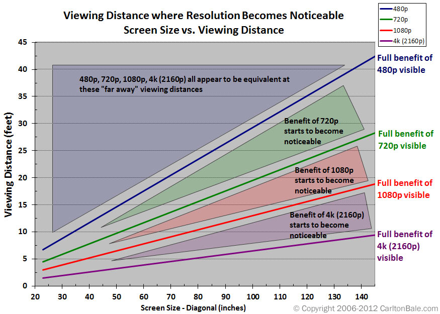
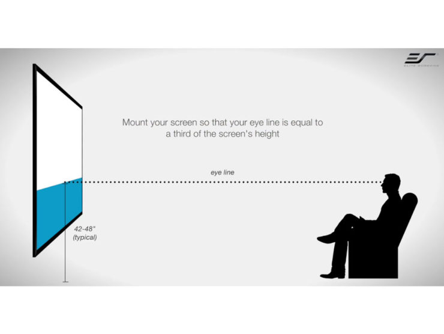

Might be worth looking at Epson home cinema projectors. I went with Epson because you whatever projector you get you'll be replacing the bulb every couple of years and last I checked, Epson doesn't screw you as hard on those.

It's <em>significantly</em> more work to install than a TV but you're probably not going to buy a TV the size of your wall.

After installing it in 4 different places I've learned not to pretend that you're going to successfully mount it off angle and mess around with trapezoids to get it lined up right.

The fewer axes of adjustment you use after installing the better. Pitch + yaw + roll  + zoom is madness at 4, but I like to go for 0. Figure out where you are putting the screen first, then find where the projector wants to be based on its throw distance. Probably some kind of short throw projector will fit fine unless you have a room size that is not very deep from the screen wall to opposing wall.

Also depending on the numbers you may find that 1080 is already higher than "retina" resolution at your viewing distance so it may be a waste to pay for a 4k projector. Also some 4k projectors are fake -- they downscale a 4k input onto a 1080 DMD.

There's also a simple formula for the height at which your screen should be mounted:

Meanwhile if you want to move your 3rd/4th/5th/6th gen game consoles over from the CRT, you might grab a RetroTINK scaler so you can run shaders on your upscaler and get your scanlines back

I have been happy with the Qualgear brand ceiling mounts and extension arms. Use a separate piece of wood in-between if there doesn't happen to be a beam in the ceiling right where the projector wants to be. Test the alignment before you finalize the placement - two pairs of hands are good to have.

My screen is the Elite Screens 135-Inch manual - have been happy with Elite Screens also

