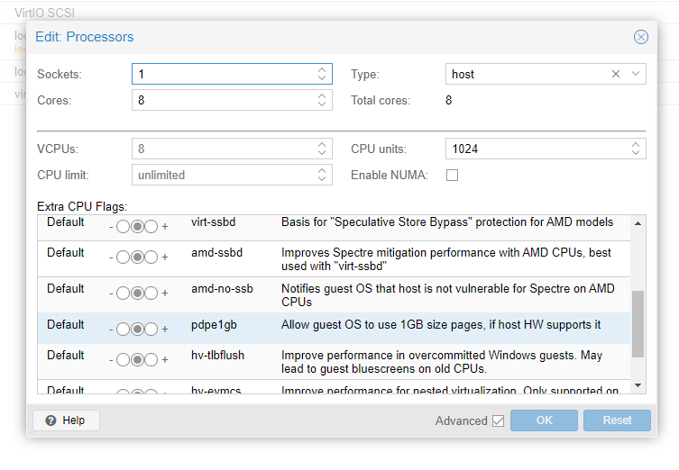

# VirtioFS filesystem VM passthrough in Proxmox

[The key info we need is in this thread on the Proxmox forum](https://forum.proxmox.com/threads/virtiofs-support.77889/)

[In particular this post is the main thing we need](https://forum.proxmox.com/threads/virtiofs-support.77889/page-2#post-527012)

## Important considerations

The example here sets up passthrough for one folder to one VM. Separate versions of the scripts listed here to be in `/var/lib/vz/snippets` would be needed for more than one instance, or the scripts would be need to be edited to use a parameter

Also, a few key items in the scripts need to be edited for each instance, and must match between the scripts. Check these:

- The socket path in `launch-virtio-daemon.sh` must match the vm config in `/etc/pve/qemu-server`
- The source folder in `launch-virtio-daemon.sh` should be the folder to pass through
- `virtiofs.pl` needs the correct path for `launch-virtio-daemon.sh`
- The virtiofs filesystem tag in the VM config file in `/etc/pve/qemu-server` will need to match the mount command or fstab entry in the guest VM

After we make the hook scripts, we need to attach them to the machine like so: `qm set 100 --hookscript local:snippets/virtiofs.pl`

### /var/lib/vz/snippets/launch-virtio-daemon.sh
```
#!/usr/bin/bash

function launch() {
    nohup /usr/lib/kvm/virtiofsd --posix-acl --syslog --socket-path=/var/run/shared-vhost-fs.sock -o source=/zfs0/shared -o cache=always &> /dev/null &
    return 0
}

launch
```

Since we are using the newer Rust based virtiofsd, we remove the `--daemonize` argument in `launch-virtio-daemon.sh` and we also add the `--posix-acl` option since we need that in the guest.

### /var/lib/vz/snippets/virtiofs.pl
```
#!/usr/bin/perl

# Exmple hook script for PVE guests (hookscript config option)
# You can set this via pct/qm with
# pct set <vmid> -hookscript <volume-id>
# qm set <vmid> -hookscript <volume-id>
# where <volume-id> has to be an executable file in the snippets folder
# of any storage with directories e.g.:
# qm set 100 -hookscript local:snippets/hookscript.pl

use strict;
use warnings;

print "GUEST HOOK: " . join(' ', @ARGV). "\n";

# First argument is the vmid

my $vmid = shift;

# Second argument is the phase

my $phase = shift;

if ($phase eq 'pre-start') {

    # First phase 'pre-start' will be executed before the guest
    # ist started. Exiting with a code != 0 will abort the start

    print "$vmid is starting, doing preparations.\n";

    system('/var/lib/vz/snippets/launch-virtio-daemon.sh');

    # print "preparations failed, aborting."
    # exit(1);

} elsif ($phase eq 'post-start') {

    # Second phase 'post-start' will be executed after the guest
    # successfully started.

    print "$vmid started successfully.\n";

} elsif ($phase eq 'pre-stop') {

    # Third phase 'pre-stop' will be executed before stopping the guest
    # via the API. Will not be executed if the guest is stopped from
    # within e.g., with a 'poweroff'

    print "$vmid will be stopped.\n";

} elsif ($phase eq 'post-stop') {

    # Last phase 'post-stop' will be executed after the guest stopped.
    # This should even be executed in case the guest crashes or stopped
    # unexpectedly.

    print "$vmid stopped. Doing cleanup.\n";

} else {
    die "got unknown phase '$phase'\n";
}

exit(0);

```

### /etc/pve/qemu-server/111.conf

```
args: -chardev socket,id=char0,path=/var/run/shared-vhost-fs.sock \
 -device vhost-user-fs-pci,queue-size=1024,chardev=char0,tag=fileshare \
 -m 4G \
 -object memory-backend-file,id=mem,size=4G,mem-path=/dev/shm,share=on \
 -numa node,memdev=mem
```

### /etc/fstab on the guest machine

```
fileshare /zfs0/shared virtiofs defaults 0 0
```


## Huge Pages

We tried setting up hugetblfs for better performance but it locked things up and prevented the machine from booting. We don't actually need it for things to work.

[Transparent Huge Pages](https://docs.kernel.org/admin-guide/mm/transhuge.html) seem like a cleaner solution anyway.

Not yet implemented on our box but someone does have [info on using Hugepages in Proxmox](https://docs.renderex.ae/posts/Enabling-hugepages/)

"Anytime you want to create a VM with more than 64GB of RAM, you’ll want to use Hugepages."

To enable it for a VM, in the "hardware tab", under "CPU", you want to enable the hugepages flag, which is titled pdpe1gb.



And of course we also probably want it for virtiofsd performance.

On the host machine we add something like `hugepagesz=1G default_hugepagesz=2M` to `/etc/default/grub`

```
GRUB_CMDLINE_LINUX_DEFAULT="quiet intel_iommu=on hugepagesz=1G default_hugepagesz=2M"
```

Then run `update-grub` (as root) and reboot


